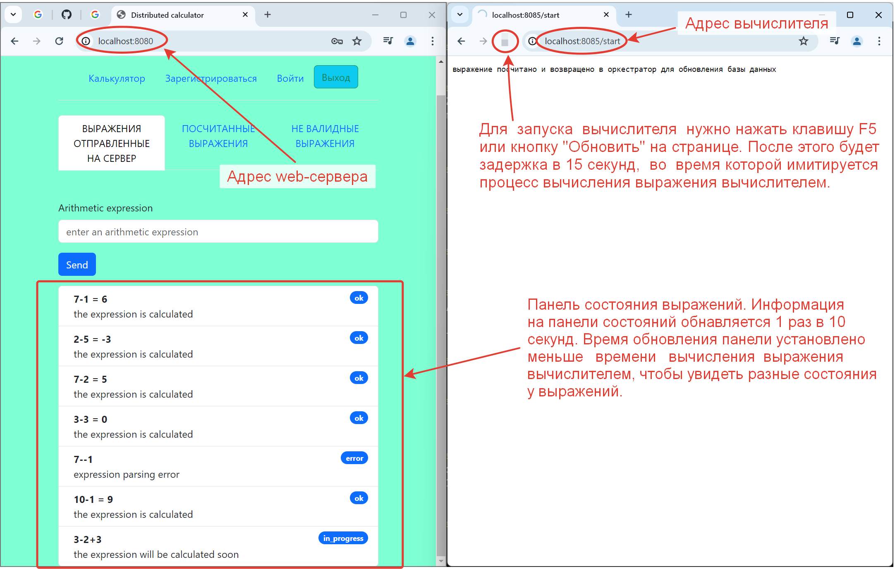

# GoCalculator
Распределенный вычислитель арифметических выражений на Golang

## Introduction  
### Условия задачи
---
Задание состоит из двух частей, подробное условие и что сделано для каждой части можно посмотреть по ссылкам ниже.  
[ЧАСТЬ 1](README_1.md)  
[ЧАСТЬ 2](README_2.md)  

## Requirements
### Для работы проекта необходимо следущее программное обеспечение или библиотеки:
`Git`, `Docker`, `Docker Compose`.

- Для скачивания и установки `Git` перейти по ссылке https://git-scm.com/downloads, установить согласно инструкции для своей операционной системы.
- Для скачивания и установки `Docker` перейти по ссулке https://www.docker.com/get-started/, установить согласно инструкции для своей операционной системы.
- Для скачивания и установки `Docker Compose` перейти по ссулке https://docs.docker.com/compose/install/, установить согласно инструкции для своей операционной системы.

## Installation and Usage
### Инструкции по установке и использованию 
__Команды указаны для операционной системы Linux и терминала `bash`__
1. Установить необходимое программное обеспечение и библиотеки (_смотри предыдущий раздел_).
2. Клонировать репозиторий на локальный компьютер
```bash
git clone https://github.com/EvSedov/GoCalculator.git
```
3. Перейти в папку проекта 
```bash
cd GoCalculator
```
4. Собрать проект командой `docker-compose build`
5. Запустить проект командой `docker-compose up`
6. Для остановки проекта в терминале нажать комбинацию клавиш `Ctrl+C`
7. Для удаления базы данных набрать команду `docker-compose rm db` далее необходимо подтвердить удаление нажав `y`
8. Для остановки и удаления контейнеров и сети с компьютера набрать команду `docker-compose down`

__Примечание:__ для работы bootstrap необходим доступ к интернету.

## Summary
### Что сделано по задаче
1. Реализована регистрация и авторизация пользователя. При отправке выражений проверяется достоверность пользователя с помощью `JWT токена`. Если пользователь проверку не прошел, то он не получит доступ к работе с backtnd-ом и отправляемые им данные не будут сохраняться в базе данных и отправляться для вычисления (+20 баллов).
2. На backend-е все данные сохраняются в базе данных, приложение восстанавливает свое состояние при перезагрузке (+20 баллов).

### Использование проекта  
Для проверки работы проекта необходимо, после старта проекта, в браузере открыть две вкладки по указанным адресам запуска: web-сервера (http://127.0.0.1:8080) и вычислителя (http://127.0.0.1:8085/start).  
1. Web-сервер запуститься по адресу http://127.0.0.1:8080
  - На web-сервере будет одна страница. После регистрации станет доступна страница с формой для отправки выражений. Под формой будет отображаться список отправленных выражений, который будет обновляться с интервалом в 10 секунд. (TODO: Во второй вкладке будут указаны вычисленные выражения. В третьей вкладке будут указаны не валидные выражения).
  - Сервер считает арифметически верно составленные выражения, состоящие из чисел, скобок и операторов "__+ - * /__"
2. Вычислитель запустится по адресу http://127.0.0.1:8085
  - Для проверки работы вычислителя необходимо перейти по адресу http://127.0.0.1:8085/start (при переходе по данному пути или при обновлении вкладки браузера на данном пути, из вычислителя будет отправлен GET запрос в оркестратор, для получения валидного выражения, затем вычисление будет вычислено и будет отправлен POST запрос в оркестратор с результатом вычисления.  
  __!!! ВАЖНО:__ для получения и отправки одного выражения из оркестратора нужно обновить страницу вычислителя __ОДИН РАЗ!!!__).
3. Алгоритм проверки работоспособности распределенного калькулятора:
  - Ввести в форме web-сервера выражение и нажать кнопку "Send" (можно поочередно отправить несколько выражений, так даже интереснее). Отправленное выражение отобразится под формой, у него дополнительно будет указан статус (error, valid, ok) и краткое описание. Когда выражение будет посчитано, то оно будет отображаться с решением указанным через знак "=". 
  - Перейти на вкладку вычислителя по адресу http://127.0.0.1:8085/start и обновить страницу (при первом открытии вкладки обновлять страницу не нужно). Перед отправкой выражения вычислителю оркестратор устанавливает ему статус `in_progress`.
  - Вернуться на вкладку web-сервера и подождать обновления состояний выражений (интервал обновлений 10 секунд, состояния обновляются автоматически). Web-сервер запросит актуальные данные с оркестратора и отобразит их на странице (TODO: в том числе распределит их по вкладкам в зависимости от статуса выражений).
  - Повторить пункты по порядку с начала.

  ### Пример работы с проектом в картинках
  

## License
- тип лицензии, под которой распространяется проект Apache License 2.0

## Authors and Contacts
Автор: Евгений Седов

Телеграм для связи: @evsedov 
