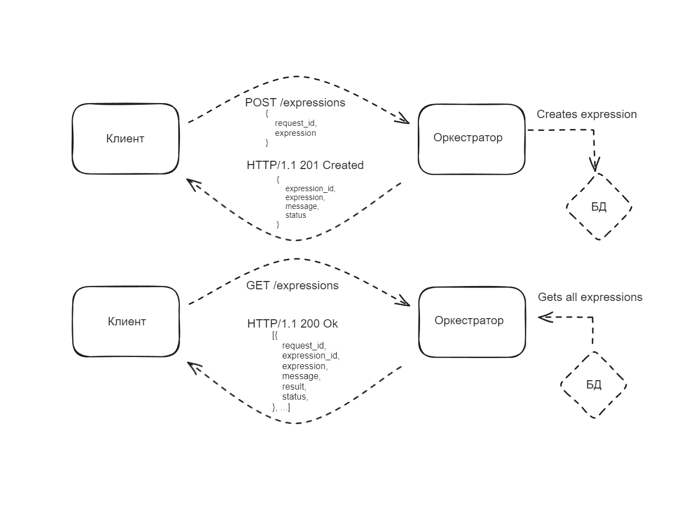
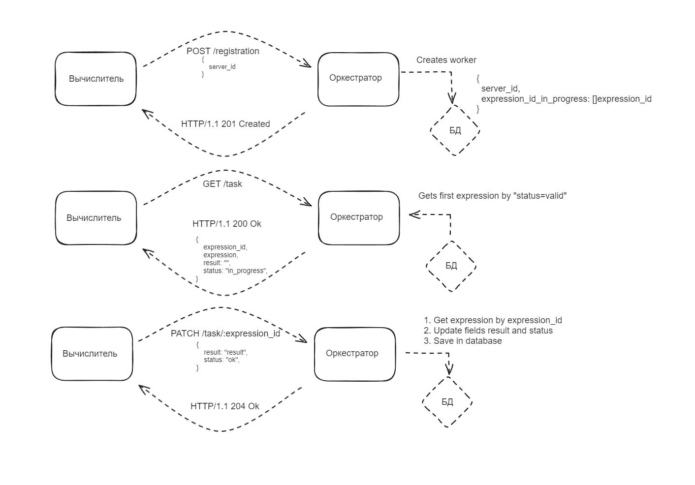
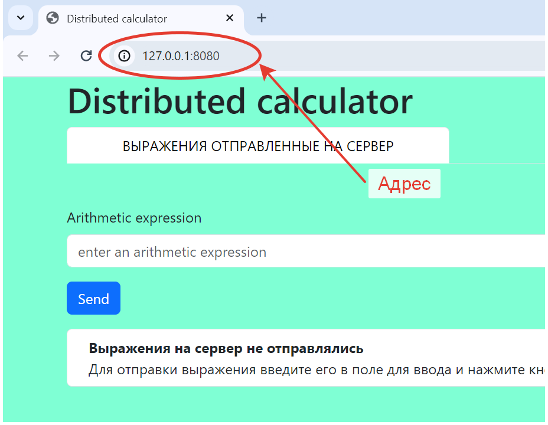
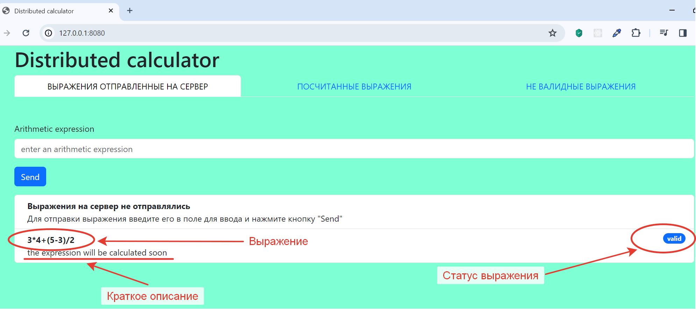
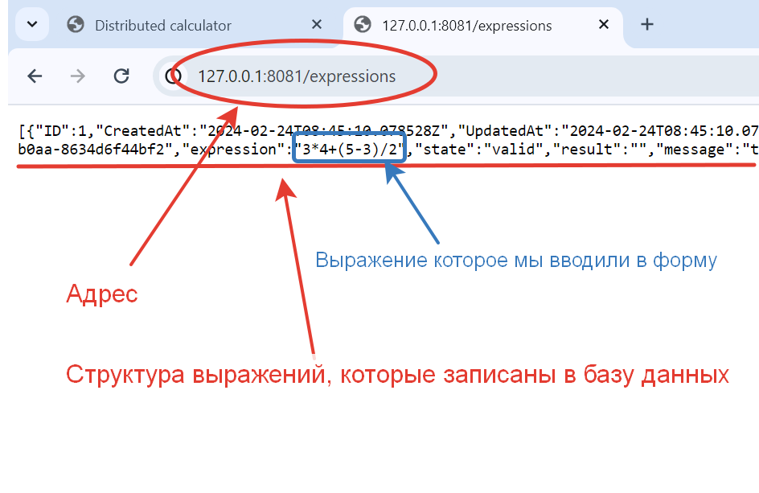
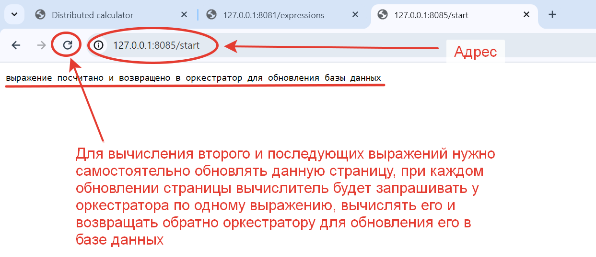
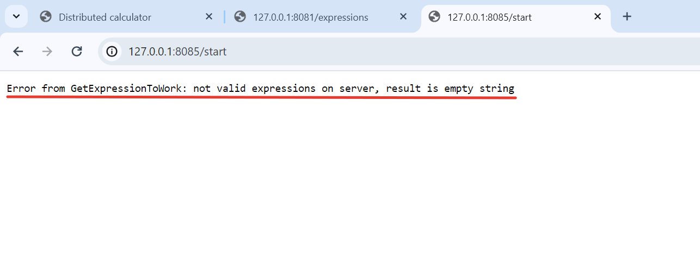
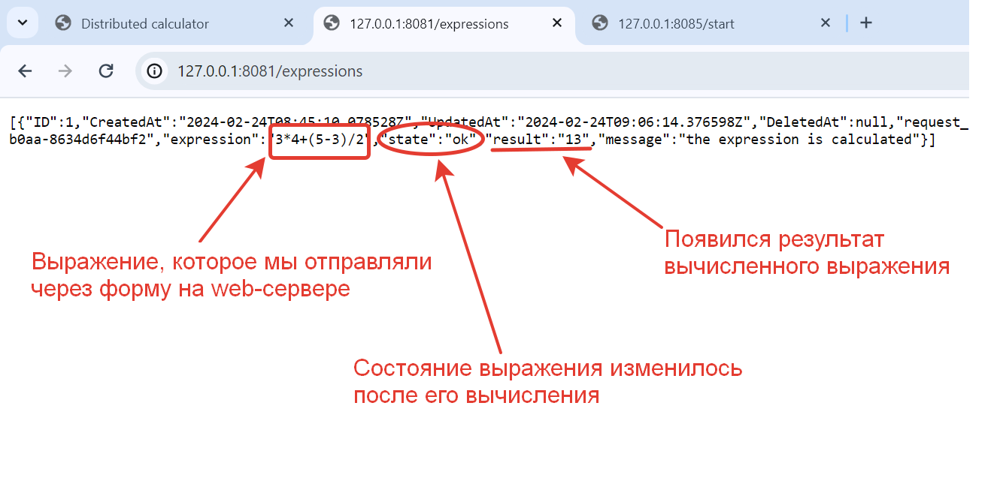
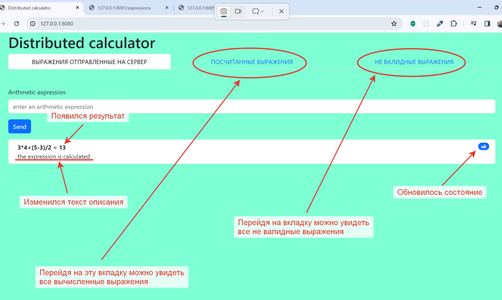
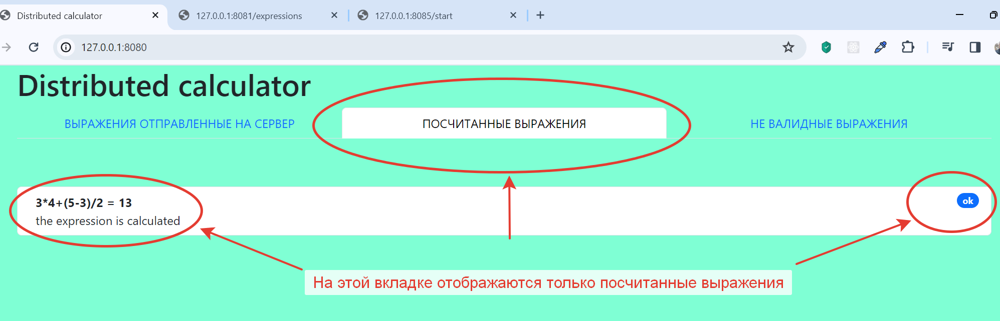

# GoCalculator
Распределенный вычислитель арифметических выражений на Golang

## Introduction  
### Условия задачи
---
Пользователь хочет считать арифметические выражения. Он вводит строку 2 + 2 * 2 и хочет получить в ответ 6. Но наши операции сложения и умножения (также деления и вычитания) выполняются "очень-очень" долго. Поэтому вариант, при котором пользователь делает http-запрос и получает в качетсве ответа результат, невозможна. Более того вычисление каждой такой операции в нашей "альтернативной реальности" занимает "гигантские" вычислительные мощности. Соответственно, каждое действие мы должны уметь выполнять отдельно и масштабировать эту систему можем добавлением вычислительных мощностей в нашу систему в виде новых "машин". Поэтому пользователь, присылая выражение, получает в ответ идентификатор выражения и может с какой-то периодичностью уточнять у сервера "не посчиталость ли выражение"? Если выражение наконец будет вычислено - то он получит результат. Помните, что некоторые части арфиметического выражения можно вычислять параллельно.

Проект состоит из двух частей Front-end и Back-end.
---
### Front-end
---
GUI, который можно представить как 4 страницы:
- Форма ввода арифметического выражения.

  Пользователь вводит арифметическое выражение и отправляет POST http-запрос с этим выражением на back-end. Примечание: Запросы должны быть идемпотентными. К запросам добавляется уникальный идентификатор. Если пользователь отправляет запрос с идентификатором, который уже отправлялся и был принят к обработке - ответ 200. Возможные варианты ответа:
  - 200 (выражение успешно принято, распаршено и принято к обработке)
  - 400 (выражение невалидно)
  - 500 (что-то не так на back-end)   
  В качестве ответа нужно возвращать id принятного к выполнению выражения.

- Страница со списком выражений в виде списка с выражениями. Каждая запись на странице содержит статус, выражение, дату его создания и дату заверщения вычисления. Страница получает данные GET http-запрсом с back-end-а
- Страница со списком операций в виде пар: имя операции + время его выполнения (доступное для редактирования поле). Как уже оговаривалось в условии задачи, наши операции выполняются "как будто бы очень долго". Страница получает данные GET http-запрсом с back-end-а. Пользователь может настроить время выполения операции и сохранить изменения.
- Страница со списком вычислительных можностей. Страница получает данные GET http-запросом с сервера в виде пар: имя вычислительного ресурса + выполняемая на нём операция.

### Back-end
---
Состоит из 2 элементов:
- Сервер, который принимает арифметическое выражение, переводит его в набор последовательных задач и обеспечивает порядок их выполнения. Далее будем называть его оркестратором.
- Вычислитель, который может получить от оркестратора задачу, выполнить его и вернуть серверу результат. Далее будем называть его агентом.

#### Оркестратор
Сервер, который имеет следующие endpoint-ы:
- Добавление вычисления арифметического выражения.
- Получение списка выражений со статусами.
- Получение значения выражения по его идентификатору.
- Получение списка доступных операций со временем их выполения.
- Получение задачи для выполения.
- Приём результата обработки данных.

#### Требования: 
- Оркестратор может перезапускаться без потери состояния.
- Все выражения храним в СУБД.
- Оркестратор должен отслеживать задачи, которые выполняются слишком долго (вычислитель тоже может уйти со связи) и делать их повторно доступными для вычислений.

## Summary
### Что сделано по задаче
- Веб-сервер, который отображает страничку с формой, заполнив которую можно отправить POST запрос на сервер-оркестратор и получить от него ответ в виде `json`. Далее ответ парсится, а затем на страницу добавляется html-элемент, на котором отражено выражение, его краткое описание и статус выражения.
- Сервер-окестратор, который получает POST запрос из формы с web-сервера, убирает из выражения все пробелы, валидирует его и отдает ответ на сервер в виде `json`. Оркестратор умеет создавать модель Expression, сохранять ее в БД, извлекать из БД все выражения или конкретное выражение по параметру `expression_id`, обновляет выражение, которое было вычислено сервером-вычислителем.
- Добавил базу данных для сохранения оркестратором поступивших к нему выражений. Сервер-оркестратор сохраняет все выражения в БД, которые можно увидеть на странице по endpoint `/expressions` или можно увидеть конкретное выражение для параметра expression_id по endpoint `/expressions/:expression_id`.
- Сервер-вычислитель, который может получать выражение от оркестратора, вычисляет выражение и отправляет его обратно на оркестратор с результатом вычисления.
- Упаковал все сервисы в `docker-compose`, настроил их сборку и запуск, добавил горячую перезагрузку сервисов с помощью библиотеки `air`. 
- Написал README.md

### Что не сделано по задаче
- Не распарсил выражения.
- Не реализовал логику контроля работы за вычислителем.
- Не реализовал параллельное вычисление разных подвыражений одного выражения разными вычислителями.
- Не реализовал конфигурирование работы серверов через веб интерфейс. 

### Схемы взаимодействия
- Схема взаимодействия web-сервера и сервера-оркестратора

- Схема взаимодействия сервера-оркестратора и сервера-вычислителя

### Использование проекта  
Для проверки работы проекта необходимо, после старта проекта, в браузере открыть три вкладки по указанным адресам запуска: web-сервера (http://127.0.0.1:8080), оркестратора (http://127.0.0.1:8081/expressions) и вычислителя (http://127.0.0.1:8085/start).  
1. Web-сервер запуститься по адресу http://127.0.0.1:8080
  - На web-сервере будет одна страница, а на ней три вкладки. Сервер откроется на первой вкладке, где будет отображаться форма для отправки выражений, а под формой список отправленных выражений. Во второй вкладке будут указаны вычисленные выражения. В третьей вкладке будут указаны не валидные выражения.
  - Сервер считает арифметически верно составленные выражения, состоящие из чисел, скобок и операторов "__+ - * /__"
2. Оркестратор запустится по адресу http://127.0.0.1:8081.
  - Для проверки работы оркестратора необходимо перейти по адресу http://127.0.0.1:8081/expressions (по данному пути, при первом переходе и при обновлении вкладки браузера, из базы данных будут извлекаться все выражения и отображаться на странице). 
3. Вычислитель запустится по адресу http://127.0.0.1:8085
  - Для проверки работы вычислителя необходимо перейти по адресу http://127.0.0.1:8085/start (при переходе по данному пути или при обновлении вкладки браузера на данном пути, из вычислителя будет отправлен GET запрос в оркестратор, для получения валидного выражения, затем вычисление будет вычислено в вычислителе и вычислителем будет отправлен POST запрос в оркестратор с результатом вычисления, для обновления оркестратором выражения в базе данных.  
  __!!! ВАЖНО:__ для получения и отправки одного выражения из оркестратора нужно обновить страницу вычислителя __ОДИН РАЗ!!!__).
4. Алгоритм проверки работоспособности распределенного калькулятора:
  - Ввести в форме web-сервера выражение и нажать кнопку "Send" (можно поочередно отправить несколько выражений, так даже интереснее). Отправленное выражение отобразится под формой, у него дополнительно будет указан статус (error, valid, ok) и краткое описание. Когда выражение будет посчитано, то оно будет отображаться с решением указанным через знак "=". 
  - Перейти на вкладку оркестратора по адресу http://127.0.0.1:8081/expressions (при первом открытии вкладки обновлять страницу не нужно), на странице отобразятся в формате `json` все выражения, которые есть в базе данных. Если в базе данных выражений нет, то на странице будет отображаться пустой массив `[]`.
  - Перейти на вкладку вычислителя по адресу http://127.0.0.1:8085/start и обновить страницу (при первом открытии вкладки обновлять страницу не нужно). Перед отправкой выражения вычислителю оркестратор устанавливает ему статус `in_progress`.
  - Вернуться на вкладку вычислителя и обновить страницу. У вычисленного выражения появится результат и изменится статус с `in_progress` на `ok`.
  - Вернуться на вкладку web-сервера и обновить страницу. После обновления страницы web-сервер запросит актуальные данные с оркестратора и отобразит их на странице, в том числе распределит их по вкладкам в зависимости от статуса выражений.
  - Повторить пункты по порядку с начала.

### Примеры работы с проектом в картинках
- Запустить проект в соответствии с инструкцией и открыть вкладку с web-сервером

- Ввести выражение `3 * 4 + (5 - 3) / 2` и нажать кнопку `Send`. Выражение отправится на сервер-оркестратор, а под формой появится история отправленных выражений в виде списка, в котором будут указаны: выражение, его состояние и краткое описание 

- Открыть новую вкладку и запустить в ней оркестратор набрав в адресной строке `http://127.0.0.1:8081/expressions`, на странице оркестратора отобразятся все выражения, которые находятся в базе данных

- Открыть новую вкладку и запустить в ней вычислитель набрав в адресной строке `http://127.0.0.1:8085/start`, после перехода на вкладку вычислитель отправит `GET` запрос на оркестратор, получит от него валидное выражение, вичислит его и отправит обратно `POST` запрос на оркестратор для обновления в базе данных вычисленного выражения с результатом вычисления

- Если валидные выражения у оркестратора закончатся, то при очередном обновлении страницы вычислителя отобразится ошибка с текстом `Error from GetExpressionToWork: not valid expressions on server, result is empty string`

- Перейти на страницу оркестратора и обновить ее для получения обновленного состояния из базы данных, после обновления страницы оркестратора в вычисленном выражении появится значение в поле `result` и обновится состояние выражения

- Перейти на страницу web-сервера и обновить ее для получения обновленного состояния из базы данных через оркестратор, после обновления страницы вебсервера обновится состояние выражения на странице

- Нажав на вкладки на странице web-сервера можно увидеть только вычисленные или только не валидные выражения

## License
- тип лицензии, под которой распространяется проект Apache License 2.0

## Authors and Contacts
Автор: Евгений Седов

Телеграм для связи: @evsedov 
